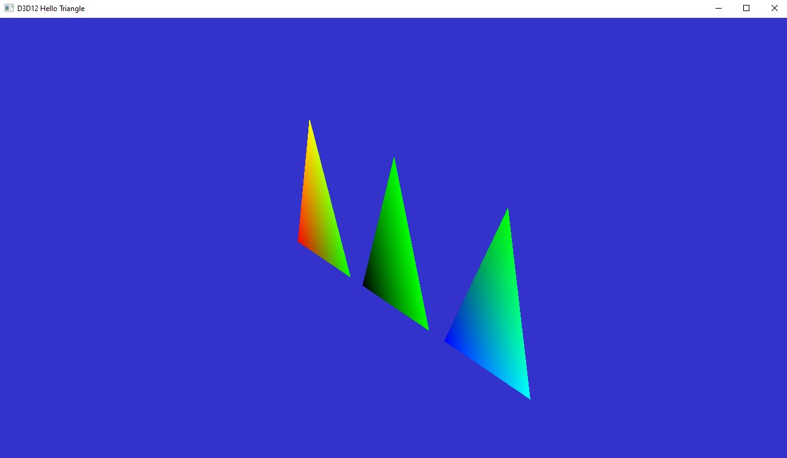
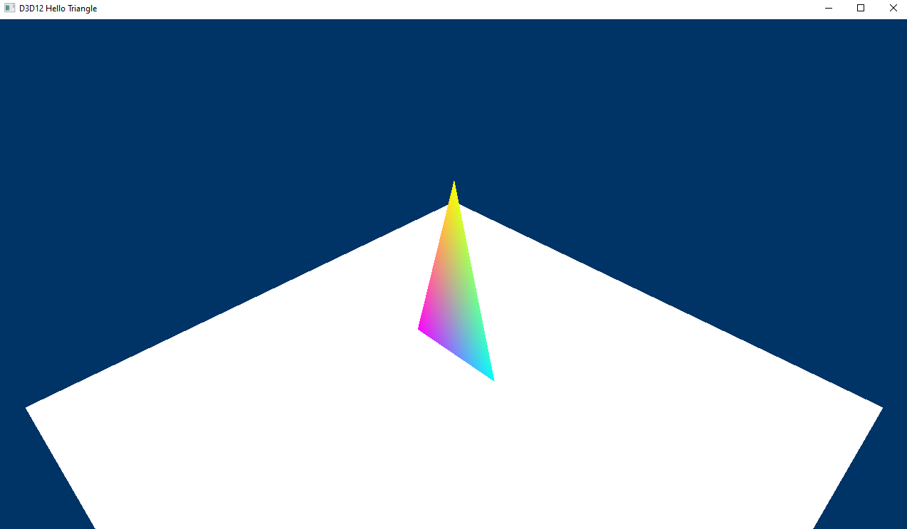
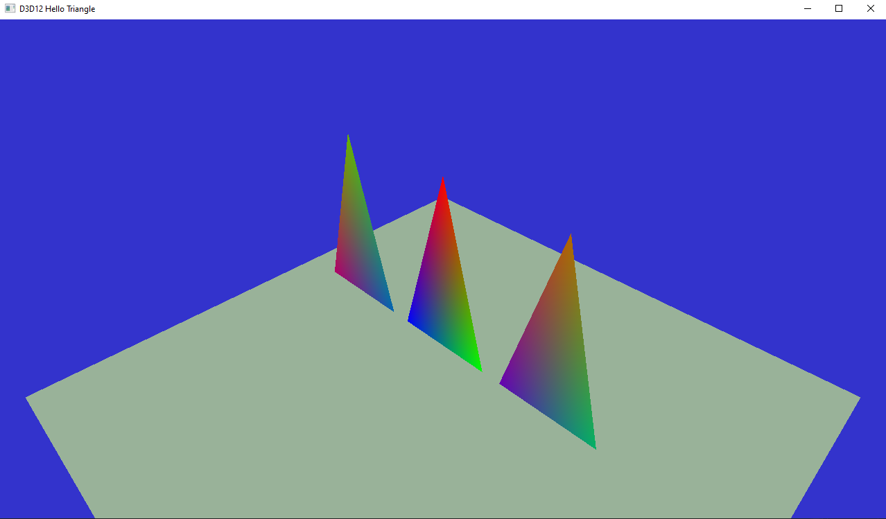
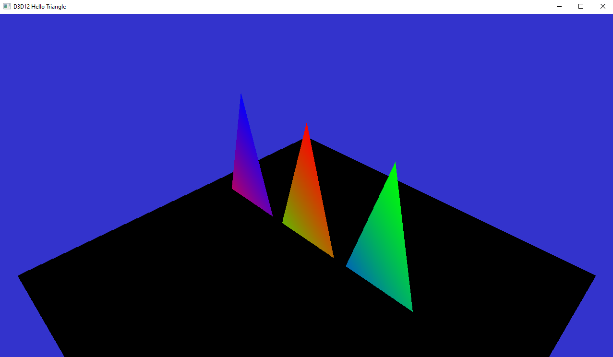

# 19. DXR Tutorial Extra : Per Instance Data
This tutorial covers the creation of object instances, each having its own shaders and resources. In order to see all the objects created in this tutorial, we strongly advise adding a perspective camera. We will create more instances of the triangle, each of which uses its own vertex colors provided by constant buffers. We also create a plane, which uses a constant buffer as well as a specific shader.

## 19.1 Adding More Instances
Adding more instances of the triangle is fairly simple, as it only requires adding those in the top-level acceleration structure.

## 19.2 CreateAccelerationStructures
In CreateAccelerationStructures, modify the instance list to create 3 instances instead of one, each with its own transform matrix.

```c++
// 19.2 #DXR Extra: Per-Instance Data
// 3 instances of the triangle
m_instances = { 
  {bottomLevelBuffers.pResult, XMMatrixIdentity()}, 
  {bottomLevelBuffers.pResult, XMMatrixTranslation(-.6f, 0, 0)}, 
  {bottomLevelBuffers.pResult, XMMatrixTranslation(.6f, 0, 0)} 
};
```

## 19.3 Hit.hlsl
In the Hit program, DXR provides the built-in InstanceID() function, which returns the ID we have passed in the third argument of AddInstance in CreateTopLevelAS.
```c++
// 19.3
switch (InstanceID())
{
case 0: hitColor = (barycentrics.x + barycentrics.y + barycentrics.z) * float3(0, 1, 0) * hitColor; // add a color that is different for each instance and then multiply that by hitcolor from vertex data buffer (BTriVertex) so triangles look different
    break;
case 1: hitColor = (barycentrics.x + barycentrics.y + barycentrics.z) * float3(1, 1, 0) * hitColor; // add a color that is different for each instance and then multiply that by hitcolor from vertex data buffer (BTriVertex) so triangles look different
    break;
case 2: hitColor = (barycentrics.x + barycentrics.y + barycentrics.z) * float3(0, 1, 1) * hitColor; // add a color that is different for each instance and then multiply that by hitcolor from vertex data buffer (BTriVertex) so triangles look different
    break;
}
```


## 19.4 Adding a Plane
We also add the creation of the vertex buffer for the plane, along with the view on the buffer for rasterization in the .h file

```
// 19.4 #DXR Extra: Per-Instance Data
ComPtr<ID3D12Resource> m_planeBuffer;
D3D12_VERTEX_BUFFER_VIEW m_planeBufferView;
void CreatePlaneVB();
```
At the end of the source file, add the vertex buffer creation code:
```c++
//-----------------------------------------------------------------------------
//
// Create a vertex buffer for the plane
//
// 19.4 #DXR Extra: Per-Instance Data
void D3D12HelloTriangle::CreatePlaneVB()
{
	// Define the geometry for a plane.
	const Vertex planeVertices[] = {
		{{-1.5f, -.8f, 01.5f}, {1.0f, 1.0f, 1.0f, 1.0f}}, // 0
		{{-1.5f, -.8f, -1.5f}, {1.0f, 1.0f, 1.0f, 1.0f}}, // 1
		{{01.5f, -.8f, 01.5f}, {1.0f, 1.0f, 1.0f, 1.0f}}, // 2
		{{01.5f, -.8f, 01.5f}, {1.0f, 1.0f, 1.0f, 1.0f}}, // 2
		{{-1.5f, -.8f, -1.5f}, {1.0f, 1.0f, 1.0f, 1.0f}}, // 1
		{{01.5f, -.8f, -1.5f}, {1.0f, 1.0f, 1.0f, 1.0f}} // 4
	};

	const UINT planeBufferSize = sizeof(planeVertices);

	// Note: using upload heaps to transfer static data like vert buffers is not
	// recommended. Every time the GPU needs it, the upload heap will be
	// marshalled over. Please read up on Default Heap usage. An upload heap is
	// used here for code simplicity and because there are very few verts to
	// actually transfer.
	CD3DX12_HEAP_PROPERTIES heapProperty =
		CD3DX12_HEAP_PROPERTIES(D3D12_HEAP_TYPE_UPLOAD);
	CD3DX12_RESOURCE_DESC bufferResource =
		CD3DX12_RESOURCE_DESC::Buffer(planeBufferSize);
	ThrowIfFailed(m_device->CreateCommittedResource(
		&heapProperty, D3D12_HEAP_FLAG_NONE, &bufferResource, //
		D3D12_RESOURCE_STATE_GENERIC_READ, nullptr,
		IID_PPV_ARGS(&m_planeBuffer)));

	// Copy the triangle data to the vertex buffer.
	UINT8* pVertexDataBegin;
	CD3DX12_RANGE readRange(
		0, 0); // We do not intend to read from this resource on the CPU.
	ThrowIfFailed(m_planeBuffer->Map(
		0, &readRange, reinterpret_cast<void**>(&pVertexDataBegin)));
	memcpy(pVertexDataBegin, planeVertices, sizeof(planeVertices));
	m_planeBuffer->Unmap(0, nullptr);
	
	// Initialize the vertex buffer view.
	m_planeBufferView.BufferLocation = m_planeBuffer->GetGPUVirtualAddress();
	m_planeBufferView.StrideInBytes = sizeof(Vertex);
	m_planeBufferView.SizeInBytes = planeBufferSize;
}
```

## 19.5 LoadAssets
The plane buffers are added in LoadAssets, immediately after initializing m_vertexBufferView.
Line 295 if using this code.
```c++
// 19.5 #DXR - Per Instance
// Create a vertex buffer for a ground plane, similarly to the triangle definition above
CreatePlaneVB();
```
## 19.6 CreateAccelerationStructures
After creating the bottom-level AS of the triangle, add the creation of the BLAS of the plane:
```c++
// 19.6 #DXR Extra: Per-Instance Data
AccelerationStructureBuffers planeBottomLevelBuffers = CreateBottomLevelAS({{m_planeBuffer.Get(), 6}});
```
Then we add a reference to the bottom-level AS of the plane in the instance list:
```c++
m_instances = {
	{bottomLevelBuffers.pResult, DirectX::XMMatrixIdentity()},
	{bottomLevelBuffers.pResult, DirectX::XMMatrixTranslation(.6f, 0, 0)},
	{bottomLevelBuffers.pResult, DirectX::XMMatrixTranslation(-.6f, 0, 0)},
	// 19.6 #DXR Extra: Per-Instance Data
	{planeBottomLevelBuffers.pResult, DirectX::XMMatrixTranslation(0, 0, 0)}
};
```

## 19.7 PopulateCommandList
To be visible in the rasterization path, we add the following lines before the DrawInstanced call for the triangle since there is no depth buffer (z buffer) being used right now:
```c++
// 19.7 #DXR Extra: Per-Instance Data
// In a way similar to triangle rendering, rasterize the plane
m_commandList->IASetVertexBuffers(0, 1, &m_planeBufferView);
m_commandList->DrawInstanced(6, 1, 0, 0);
```
There will be no instancing for the rasterization triangle since it is out of scope for RTX, but the plane will be displayed as pictured below


## 19.8 Using a Constant Buffer
Constant buffer are used to send read-only data from the CPU side to the shaders. Here we will create a constant buffer containing color data, used in the shader to alter the vertex colors. Add the declarations in the header file:
```c++
// 19.8 #DXR Extra: Per-Instance Data
void D3D12HelloTriangle::CreateGlobalConstantBuffer();
ComPtr<ID3D12Resource> m_globalConstantBuffer;
```
Add the buffer allocation method at the end of the source file.
```c++
//-----------------------------------------------------------------------------
//
// 19.8 #DXR Extra: Per-Instance Data
void D3D12HelloTriangle::CreateGlobalConstantBuffer()
{ 
	// Due to HLSL packing rules, we create the CB with 9 float4 (each needs to start on a 16-byte 
	// boundary) 
	XMVECTOR bufferData[] = { 
		// A 
		XMVECTOR{1.0f, 0.0f, 0.0f, 1.0f}, 
		XMVECTOR{0.7f, 0.4f, 0.0f, 1.0f},
		XMVECTOR{0.4f, 0.7f, 0.0f, 1.0f}, 
		// B 
		XMVECTOR{0.0f, 1.0f, 0.0f, 1.0f}, 
		XMVECTOR{0.0f, 0.7f, 0.4f, 1.0f},
		XMVECTOR{0.0f, 0.4f, 0.7f, 1.0f}, 
		// C 
		XMVECTOR{0.0f, 0.0f, 1.0f, 1.0f}, 
		XMVECTOR{0.4f, 0.0f, 0.7f, 1.0f}, 
		XMVECTOR{0.7f, 0.0f, 0.4f, 1.0f}, 
	}; 
	// Create our buffer 
	m_globalConstantBuffer = 
		nv_helpers_dx12::CreateBuffer( m_device.Get(), sizeof(bufferData), D3D12_RESOURCE_FLAG_NONE, D3D12_RESOURCE_STATE_GENERIC_READ, nv_helpers_dx12::kUploadHeapProps); 
	// Copy CPU memory to GPU 
	uint8_t* pData; 
	ThrowIfFailed(m_globalConstantBuffer->Map(0, nullptr, (void**)&pData)); 
	memcpy(pData, bufferData, sizeof(bufferData)); 
	m_globalConstantBuffer->Unmap(0, nullptr);
}
```
## 19.9 OnInit
The creation of the constant buffer can be added right after the call to CreateRayTracingPipeline:
```c++
// 19.9 #DXR Extra: Per-Instance Data
// Create a constant buffers, with a color for each vertex of the triangle, for each
// triangle instance
CreateGlobalConstantBuffer();
```
## 19.10 CreateHitSignature
Now the geometry is set with the triangles, but the shaders have not been adapted yet to use the constant buffer. We first need to modify the root signature of the hit shader to use a constant buffer passed as a root parameter. Contrary to the buffers passed on the heap, root parameters can be passed per instance. Since this is the first constant buffer we declare in the root signature, we bind it to register 0: it will be accessible as register(b0) in the HLSL code.
```c++
// 19.10 #DXR Extra: Per-Instance Data
// The vertex colors may differ for each instance, so it is not possible to
// point to a single buffer in the heap. Instead we use the concept of root
// parameters, which are defined directly by a pointer in memory. In the
// shader binding table we will associate each hit shader instance with its
// constant buffer. Here we bind the buffer to the first slot, accessible in
// HLSL as register(b0)
rsc.AddRootParameter(D3D12_ROOT_PARAMETER_TYPE_CBV, 0);
```
## 19.11 CreateShaderBindingTable
The hit group for the triangle needs to access the constant buffer. For this, we add the pointer to the constant buffer in GPU memory to the set of resources accessed by the hit group.
```c++
// 19.11 #DXR Extra: Per-Instance Data
// Adding the triangle hit shader and constant buffer data
m_sbtHelper.AddHitGroup(L"HitGroup", { (void*)m_globalConstantBuffer->GetGPUVirtualAddress() });
```
## 19.12 Hit.hlsl
To access the constant buffer we replicate its structure in the HLSL code, and indicate the buffer is bound to the b0 register:
```c++
// 19.12 #DXR Extra: Per-Instance Data
cbuffer Colors : register(b0)
{ 
	float3 A[3]; 
	float3 B[3]; 
	float3 C[3];
}
```
In the shader, we can directly access the buffer using the instance ID of the triangles to obtain a different color for each instance.
```c++
// 19.12 #DXR Extra: Per-Instance Data
float3 hitColor = float3(0.6, 0.7, 0.6);
// Shade only the first 3 instances (triangles)
if (InstanceID() < 3)
{
hitColor = A[InstanceID()].xyz * barycentrics.x + B[InstanceID()].xyz * barycentrics.y + C[InstanceID()].xyz * barycentrics.z;
}
```


## 19.13 Accessing memory differently
In the previous section we replicated the structure of the constant buffer exactly in the HLSL code. However, the mapping from the original data to the shader is arbitrary. For example, we could map it as an array of structures.
```c++
// 19.13 #DXR Extra: Per-Instance Data
struct MyStructColor
{
    float4 a; 
    float4 b; 
    float4 c;
};
cbuffer Colors : register(b0)
{
    MyStructColor Tint[3];
}
```
For each instance, we can now access the data this way:
```c++
// 19.13 #DXR Extra: Per-Instance Data
int instanceID = InstanceID();
float3 hitColor = Tint[instanceID].a * barycentrics.x + Tint[instanceID].b * barycentrics.y + Tint[instanceID].c * barycentrics.z;
```

