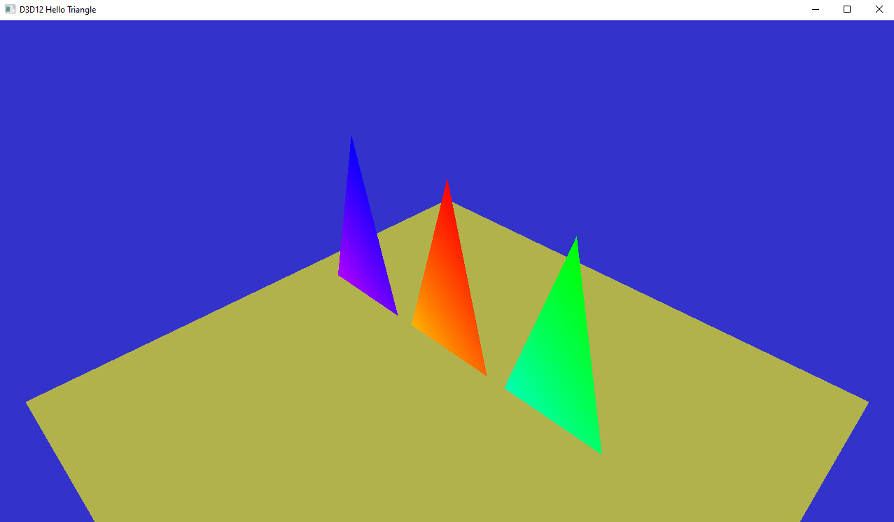

# 20. Per-Instance Constant Buffer

## 20.1 Using Per-Instance Constant Buffer
In most practical cases, the constant buffers are defined per-instance so that they can be managed independently. Add the declaration of an array of per-instance buffers in the header file:
```c++
// 20.1 #DXR Extra: Per-Instance Data
void CreatePerInstanceConstantBuffers();
std::vector<ComPtr<ID3D12Resource>> m_perInstanceConstantBuffers;
```
We can now add the allocation and setup of those buffers at the end of the source file. We create one buffer for each triangle.
```c++
//-----------------------------------------------------------------------------
//
// 20.1 #DXR Extra: Per-Instance Data
void D3D12HelloTriangle::CreatePerInstanceConstantBuffers()
{ 
	// Due to HLSL packing rules, we create the CB with 9 float4 (each needs to start on a 16-byte 
	// boundary) 
	XMVECTOR bufferData[] = { 
		// A 
		XMVECTOR{1.0f, 0.0f, 0.0f, 1.0f}, 
		XMVECTOR{1.0f, 0.4f, 0.0f, 1.0f}, 
		XMVECTOR{1.f, 0.7f, 0.0f, 1.0f}, 
		// B 
		XMVECTOR{0.0f, 1.0f, 0.0f, 1.0f}, 
		XMVECTOR{0.0f, 1.0f, 0.4f, 1.0f}, 
		XMVECTOR{0.0f, 1.0f, 0.7f, 1.0f}, 
		// C 
		XMVECTOR{0.0f, 0.0f, 1.0f, 1.0f}, 
		XMVECTOR{0.4f, 0.0f, 1.0f, 1.0f}, 
		XMVECTOR{0.7f, 0.0f, 1.0f, 1.0f}, 
	}; 
	m_perInstanceConstantBuffers.resize(3); 
	int i(0); 
	for (auto& cb : m_perInstanceConstantBuffers) 
	{ 
		const uint32_t bufferSize = sizeof(XMVECTOR) * 3; 
		cb = nv_helpers_dx12::CreateBuffer(m_device.Get(), bufferSize, D3D12_RESOURCE_FLAG_NONE, D3D12_RESOURCE_STATE_GENERIC_READ, nv_helpers_dx12::kUploadHeapProps); 
		uint8_t* pData; 
		ThrowIfFailed(cb->Map(0, nullptr, (void**)&pData)); 
		memcpy(pData, &bufferData[i * 3], bufferSize); 
		cb->Unmap(0, nullptr); 
		++i; 
	}
}
```
## 20.2 OnInit
The creation of the constant buffer can be added right after the call to CreateRayTracingPipeline:
```c++
// 20.2 #DXR Extra: Per-Instance Data
CreatePerInstanceConstantBuffers();
```
## 20.3 CreateShaderBindingTable
The hit groups for each instance and the actual pointers to the constant buffer are then set in the Shader Binding Table. We will add a hit group for each triangle, and one for the plane, so that each can point to its own constant buffer. Replace the triangle hit group by:
```c++
// 20.3 #DXR Extra: Per-Instance Data
// We have 3 triangles, each of which needs to access its own constant buffer
// as a root parameter in its primary hit shader. The shadow hit only sets a
// boolean visibility in the payload, and does not require external data
for (int i = 0; i < 3; ++i) 
{
	m_sbtHelper.AddHitGroup(L"HitGroup", { (void*)(m_perInstanceConstantBuffers[i]->GetGPUVirtualAddress()) });
}
// The plane also uses a constant buffer for its vertex colors
m_sbtHelper.AddHitGroup(L"HitGroup", { (void*)(m_perInstanceConstantBuffers[0]->GetGPUVirtualAddress()) });
```
The triangles will then all invoke the same shader, but use different constant buffers. The plane uses the same constant buffer as the first triangle for simplicity.

## 20.4 CreateTopLevelAS
Now the instances are independent, we need to associate the instances with their own hit group in the SBT. This is done by modifying the AddInstance call by indicating that the instance index i is also the index of the hit group to use in the SBT. This way, hitting the i-th triangle will invoke the first hit group defined in the SBT, itself referencing m_perInstanceConstantBuffers[i]:
```c++
// 20.4 #DXR Extra: Per-Instance Data
for (size_t i = 0; i < instances.size(); i++)
{
	m_topLevelASGenerator.AddInstance(instances[i].first.Get(), instances[i].second, static_cast<UINT>(i), static_cast<UINT>(i));
}
```
## 20.5 Hit.hlsl
Now, for each hit, DXR will bind the associated constant buffer, hence avoiding the need to declare and dereference arrays:
```c++
// 20.5 #DXR Extra: Per-Instance Data
cbuffer Colors : register(b0)
{
    float3 A; 
    float3 B; 
    float3 C;
}
```
The computation of the final color is then simplified by accessing the member of the constant buffer directly:
```c++
// 20.5 #DXR Extra: Per-Instance Data
float3 hitColor = A * barycentrics.x + B * barycentrics.y + C * barycentrics.z;
```


## 20.6 Adding a Specific Hit Shader for the Plane
Until now all the geometry used a single shader. In practice, a scene with different object type will most likely require as many different shaders. In this section we will apply a separate shader for the plane.

## 20.7 Hit.hlsl
Add a new shader in the file:
```c++
// 20.7 #DXR Extra: Per-Instance Data
[shader("closesthit")]
void PlaneClosestHit(inout HitInfo payload, Attributes attrib)
{
    float3 barycentrics = float3(1.f - attrib.bary.x - attrib.bary.y, attrib.bary.x, attrib.bary.y); 
    float3 hitColor = float3(0.7, 0.7, 0.3); 
    payload.colorAndDistance = float4(hitColor, RayTCurrent());
}
```
## 20.8 CreateRaytracingPipeline
This new shader has to be added to the raytracing pipeline, first by adding its symbol when adding m_hitLibrary:

```c++
// 20.8 #DXR Extra: Per-Instance Data
pipeline.AddLibrary(m_hitLibrary.Get(), {L"ClosestHit", L"PlaneClosestHit"});
```
We also need to add a new hit group after adding HitGroup, called PlaneHitGroup:

```c++
// 20.8 #DXR Extra: Per-Instance Data
pipeline.AddHitGroup(L"PlaneHitGroup", L"PlaneClosestHit");
```
We also add its root signature association. Since it has the same root signature as the existing HitGroup, both can be associated to the same root signature. Modify the AddRootSignatureAssociation call as follows:

```c++
// 20.8 #DXR Extra: Per-Instance Data
pipeline.AddRootSignatureAssociation(m_hitSignature.Get(), {L"HitGroup", L"PlaneHitGroup"});
```
## 20.9 CreateShaderBindingTable
The 4th hit group of the SBT is the one corresponding to the plane. Instead of using HitGroup, we now associate it to our newly created hit group, PlaneHitGroup. Since this shader does not require any external data, we can leave its input resources empty.

```c++
// 20.9 #DXR Extra: Per-Instance Data
// Adding the plane
m_sbtHelper.AddHitGroup(L"PlaneHitGroup", {});
```

